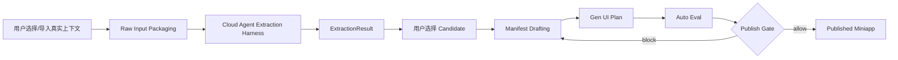

# Agentic Miniapp Builder MVP 输入输出契约讨论稿

**日期:** 2026-05-28  
**状态:** 讨论稿，未进入实现计划  
**关联文档:**
- `docs/superpowers/specs/2026-05-28-agentic-miniapp-builder-requirements-architecture.zh.md`
- `docs/superpowers/specs/2026-05-28-agentic-app-manifest-a2ui-bridge-spec.zh.md`

---

## 1. 本轮产品判断

MVP 的核心目标是验证效果：

> 给系统一批用户真实上下文，系统能否提取出有价值、可解释、可运行、可发布的 miniapp agent。

因此 MVP 不先做复杂隐私模式分层，也不做多个运行模式。第一版只保留一个主路径：

> **云端 Agent 分析用户提供的 Raw Input，产出候选能力，再进入 manifest / UI / eval / publish 流程。**

同时，架构上保留一个清晰接口，让未来可以把同一套分析 harness 换成本地用户自己的 Agent 能力来执行。这是未来兼容点，不是 MVP 的第二个产品模式。

---

## 2. 明确不做什么

MVP 暂不做：

- 本地 privacy pass。
- 多模式选择器。
- balanced / local-only / boost 三模式。
- 自动脱敏质量优化。
- 原始上下文最小披露 UX。
- 本地模型质量对比。

这些都可能重要，但不是当前效果验证阶段的主线。当前先验证：

- Raw Input 是否能稳定抽出高质量 candidate。
- candidate 是否能进一步变成靠谱的 manifest。
- manifest 是否能驱动 Gen UI 和 Auto Eval。
- 最终 miniapp 是否真的可用。

---

## 3. 为什么仍然需要 Raw Input Package

之前“Raw Input 为什么会输出 raw context bundle”这个说法容易误导。更准确的定义是：

> Raw Input 不“输出”一个 bundle；系统把用户提交的异构原始材料标准化成一个 `RawInputPackage`，作为 Candidate Extraction 的统一输入。

它的作用不是隐私处理，而是工程标准化：

1. **统一异构来源:** 聊天记录、文件、网页、任务历史、手工备注都变成同一种输入格式。
2. **稳定证据引用:** extraction 输出的 `evidence_refs` 能指回具体 source/chunk，而不是模糊地说“来自某段上下文”。
3. **支持回放调试:** 同一个 package 可以复跑 extraction，方便比较模型、prompt、agent harness 的变化。
4. **支撑未来本地 harness:** 云端 Agent 和本地 Agent 都消费同一个 `RawInputPackage` schema。
5. **分离采集和分析:** 采集层只负责组织输入；分析层负责判断有哪些可产品化能力。

所以建议把术语定为 `RawInputPackage`，不要叫 `RawContextBundle`。后者听起来像经过处理或可发布的上下文资产，容易和隐私/摘要混在一起。

---

## 4. MVP 总流程



注意：

- `Raw Input Packaging` 不做隐私承诺，只做格式化、分块、source map。
- `Cloud Agent Extraction Harness` 是 MVP 主实现。
- 未来本地 Agent 只需要实现同样的 harness 输入输出。
- Extraction 和 Manifest Drafting 可以在一个 agent pipeline 里连续执行，但系统里应持久化为两个独立产物。

---

## 5. 阶段输入输出总表

| 阶段 | 输入 | 输出 | 主要责任 |
|---|---|---|---|
| Raw Input Packaging | 用户提供的原始材料 | `RawInputPackage` | 标准化、分块、建立 source map |
| Candidate Extraction | `RawInputPackage` + extraction policy | `ExtractionResult` | 发现可产品化能力 |
| Candidate Selection | `ExtractionResult.candidates` | `SelectedCapabilityCandidate` | 选一个进入 miniapp 生成 |
| Manifest Drafting | `SelectedCapabilityCandidate` + relevant evidence | `AgenticAppManifestDraft` | 生成 agent 契约 |
| Gen UI Planning | `AgenticAppManifestDraft.interaction` | `GeneratedUiPlan` | 选择交互组件和布局 |
| Auto Eval | manifest draft + UI plan + eval cases | `EvaluationReport` | 发布前验证 |
| Publish | passed manifest + host binding | `PublishedMiniAppRecord` | 注册和分发 |

---

## 6. Raw Input

### 6.1 Raw Input 是什么

Raw Input 是用户为了生成 miniapp 主动提供的一组真实上下文材料。

它可以包括：

- 聊天记录。
- 任务执行记录。
- 文档或笔记。
- 浏览器页面摘录。
- 项目文件。
- 手工补充描述。
- 已有 agent session transcript。

Raw Input 的产品语义是：

> “请基于这些材料，帮我判断这里面有没有可复用、可分享、可产品化的工作流。”

### 6.2 Raw Input Package

`RawInputPackage` 是 Raw Input 的标准化工程表示。

```ts
type RawInputPackage = {
  packageId: string;
  ownerId: string;
  createdAt: string;
  purpose: "miniapp_candidate_extraction";
  sources: RawInputSource[];
  chunks: RawInputChunk[];
  sourceMap: RawInputSourceMapEntry[];
  packagingWarnings: RawInputWarning[];
};
```

### 6.3 RawInputSource

```ts
type RawInputSource = {
  sourceId: string;
  type:
    | "chat_transcript"
    | "agent_session"
    | "document"
    | "web_page"
    | "task_history"
    | "manual_note"
    | "code_or_project_file";
  displayName: string;
  captureMethod: "upload" | "paste" | "connector" | "local_file" | "manual";
  createdAt?: string;
  metadata?: Record<string, unknown>;
};
```

### 6.4 RawInputChunk

```ts
type RawInputChunk = {
  chunkId: string;
  sourceId: string;
  order: number;
  contentType: "text" | "markdown" | "json" | "code" | "html";
  text: string;
  approxTokens?: number;
};
```

### 6.5 RawInputSourceMapEntry

```ts
type RawInputSourceMapEntry = {
  refId: string;
  sourceId: string;
  chunkId: string;
  range?: {
    startOffset: number;
    endOffset: number;
  };
};
```

### 6.6 Raw Input Packaging 的边界

Packaging 可以做：

- 文件格式转文本。
- 分块。
- source/chunk 编号。
- 基础 token 估算。
- 记录解析失败或跳过项。

Packaging 不做：

- candidate 判断。
- manifest 生成。
- UI 生成。
- eval。
- 复杂隐私过滤。

---

## 7. Candidate Extraction

### 7.1 输入

```ts
type CandidateExtractionInput = {
  runId: string;
  package: RawInputPackage;
  extractionPolicy: CandidateExtractionPolicy;
};
```

```ts
type CandidateExtractionPolicy = {
  maxCandidates: number;
  targetProductForm: "miniapp_agent";
  preferRepeatedWorkflow: boolean;
  requireEvidence: boolean;
  minEvidenceRefsPerCandidate: number;
  allowedRecommendedForms: Array<
    "agentic_app" | "skill_set" | "automation" | "extend_existing" | "skip"
  >;
};
```

### 7.2 输出

```ts
type ExtractionResult = {
  runId: string;
  packageId: string;
  generatedAt: string;
  harness: AnalysisHarnessDescriptor;
  candidates: CapabilityCandidate[];
  rejectedIdeas: RejectedCapabilityIdea[];
  extractionNotes: string[];
  warnings: ExtractionWarning[];
};
```

### 7.3 CapabilityCandidate

```ts
type CapabilityCandidate = {
  candidateId: string;
  name: string;
  oneLineSummary: string;
  repeatedWorkflow: string;
  targetUser: string;
  jobToBeDone: string;
  recommendedForm:
    | "agentic_app"
    | "skill_set"
    | "automation"
    | "extend_existing"
    | "skip";
  confidence: "low" | "medium" | "high";
  riskLevel: "low" | "medium" | "high";
  stableInputs: string[];
  expectedOutput: string;
  evidenceRefs: EvidenceRef[];
  whyThisIsReusable: string;
  openQuestions: string[];
  generationHints?: CandidateGenerationHints;
};
```

### 7.4 EvidenceRef

```ts
type EvidenceRef = {
  refId: string;
  sourceId: string;
  chunkId: string;
  relevance: "primary" | "supporting" | "weak";
  reason: string;
};
```

MVP 里 `EvidenceRef` 可以指向 raw chunk，因为当前重点是效果验证，不先做隐私隔离。但它仍然不应该直接进入最终 published manifest 的消费者可见字段。

### 7.5 CandidateGenerationHints

Extraction 可以输出轻量 hints，但不应该在这个阶段完成 manifest 或 UI。

```ts
type CandidateGenerationHints = {
  likelyUiProfile?: string;
  suggestedStarterPrompts?: string[];
  likelyRequiredContext?: string[];
  likelyConnectors?: string[];
  likelyEvalScenarios?: string[];
};
```

这里的原则是：

- Extraction 负责“发现什么值得做”。
- Manifest Drafting 负责“把它定义成可运行 agent”。
- Gen UI 负责“把交互形式落成受控 UI plan”。

---

## 8. Extraction 是否要结合 GenAI

需要，但要分清楚“使用 GenAI 分析”和“过早生成产品契约”。

MVP 推荐：

- Candidate Extraction 使用云端 Agent/GenAI 做分析。
- 但 Extraction 输出停在 `ExtractionResult`。
- 不在 Extraction 阶段直接产出最终 manifest。
- 不在 Extraction 阶段直接决定 UI 组件。

原因：

1. **便于评估:** candidate 质量可以独立评价。
2. **便于用户选择:** 一个 raw input 可能提取出多个候选，不应该每个都立刻生成完整 miniapp。
3. **便于调试:** 如果最终 manifest 不好，可以判断是 extraction 找错方向，还是 drafting 写坏了。
4. **便于未来替换本地 harness:** 本地 Agent 只要产出同样的 `ExtractionResult`，后续流程不用改。

工程上可以为了速度把 extraction 和 manifest drafting 放在同一个后台 job 里连续执行，但产物边界要分开保存。

---

## 9. Analysis Harness

### 9.1 为什么需要 Harness 抽象

MVP 只有云端模式，但未来要允许本地 Agent 做提取。为避免到时候重写流程，抽象出 `AnalysisHarness`。

```ts
interface AnalysisHarness {
  extractCandidates(input: CandidateExtractionInput): Promise<ExtractionResult>;
}
```

### 9.2 MVP Harness

```ts
type CloudAnalysisHarnessDescriptor = {
  kind: "cloud_agent";
  provider: string;
  model?: string;
  promptVersion: string;
};
```

MVP 使用 `CloudAnalysisHarness`：

- 输入：`CandidateExtractionInput`。
- 输出：`ExtractionResult`。
- 内部可以用强模型、工具调用、multi-step reasoning。
- 对产品来说不暴露为多个模式。

### 9.3 Future Local Harness

```ts
type LocalAgentHarnessDescriptor = {
  kind: "local_agent";
  adapterId: string;
  runtimeId?: string;
  harnessVersion: string;
};
```

未来本地 harness 需要满足同样接口：

- 输入仍是 `CandidateExtractionInput`。
- 输出仍是 `ExtractionResult`。
- 后续 Manifest Drafting、Gen UI、Auto Eval 不感知它来自云端还是本地。

---

## 10. Candidate Selection

Extraction 可能输出多个 candidate。MVP 不应该自动全部生成 miniapp。

```ts
type SelectedCapabilityCandidate = {
  candidateId: string;
  selectedBy: "owner" | "system";
  selectedAt: string;
  ownerNotes?: string;
  candidate: CapabilityCandidate;
};
```

默认建议：

- 系统推荐 top 1。
- 用户可以展开查看其他 candidates。
- 只有被选中的 candidate 进入 Manifest Drafting。

---

## 11. Manifest Drafting

### 11.1 输入

```ts
type ManifestDraftingInput = {
  runId: string;
  packageId: string;
  selectedCandidate: SelectedCapabilityCandidate;
  evidence: EvidenceRef[];
  draftingPolicy: ManifestDraftingPolicy;
};
```

```ts
type ManifestDraftingPolicy = {
  manifestVersion: "0.1";
  requireHumanReview: true;
  defaultLaunchMode: "context_launch" | "chat";
  maxStarterPrompts: number;
  maxReviewQuestions: number;
};
```

### 11.2 输出

```ts
type AgenticAppManifestDraft = {
  draftId: string;
  sourceRunId: string;
  sourceCandidateId: string;
  manifest: AgenticAppManifest;
  draftStatus: "needs_review";
  reviewFocus: ReviewFocusItem[];
  evalCaseDrafts: EvalCaseDraft[];
  warnings: ManifestDraftWarning[];
};
```

Manifest Drafting 才应该正式产出：

- agent role/goal/boundaries。
- skill_set。
- interaction.ui_profile。
- required_context。
- context_contract。
- llm_boundary。
- runbook。
- safety。
- provenance。

---

## 12. Gen UI Planning

### 12.1 输入

```ts
type GenUiPlanningInput = {
  draftId: string;
  manifest: AgenticAppManifest;
};
```

### 12.2 输出

```ts
type GeneratedUiPlan = {
  planId: string;
  draftId: string;
  miniAppId: string;
  profileType: string;
  components: GeneratedUiComponent[];
  layout:
    | "thread_only"
    | "intake_then_thread"
    | "thread_with_side_panel"
    | "artifact_workspace";
  warnings: string[];
};
```

```ts
type GeneratedUiComponent = {
  name: string;
  source: "manifest" | "fallback";
  reason: string;
  requiredData: string[];
};
```

Gen UI 不直接生成任意前端代码。它只生成 UI plan，再由受控组件注册表渲染。

---

## 13. Auto Eval

### 13.1 输入

```ts
type AutoEvalInput = {
  draftId: string;
  manifest: AgenticAppManifest;
  uiPlan: GeneratedUiPlan;
  evalCases: EvalCaseDraft[];
};
```

### 13.2 输出

```ts
type EvaluationReport = {
  evaluationId: string;
  draftId: string;
  generatedAt: string;
  status: "passed" | "failed" | "warning";
  publishGate: "allow" | "block" | "manual_review";
  checks: EvaluationCheckResult[];
  summary: string;
};
```

MVP 必须阻断发布的失败：

- manifest schema 失败。
- 没有明确 target user / job / output。
- 没有 evidence refs。
- UI plan 无法降级渲染。
- mock run 不能完成。
- 安全边界字段缺失。

---

## 14. Published Miniapp

### 14.1 输入

```ts
type PublishInput = {
  draftId: string;
  manifest: AgenticAppManifest;
  uiPlan: GeneratedUiPlan;
  evaluationReport: EvaluationReport;
  hostBinding: MiniAppHostBinding;
};
```

### 14.2 输出

```ts
type PublishedMiniAppRecord = {
  miniAppId: string;
  ownerId: string;
  status: "published_private" | "published";
  manifestVersion: string;
  manifestRef: string;
  uiPlanRef: string;
  latestEvaluationId: string;
  hostBinding: MiniAppHostBinding;
  createdAt: string;
  updatedAt: string;
};
```

```ts
type MiniAppHostBinding = {
  hostId: string;
  baseAdapterId: string;
  bindingMode: "publish_time";
};
```

MVP 建议 `baseAdapterId` 在 publish 时确定，降低运行时不确定性。之后如果要动态选择，可以在 registry 层扩展。

---

## 15. 最小 MVP Definition of Done

MVP 的输入输出契约完成后，应能回答：

1. 用户提交的真实上下文如何被标准化为 `RawInputPackage`？
2. Candidate Extraction 消费什么，输出什么？
3. 一个 candidate 为什么值得变成 miniapp？
4. Extraction 和 Manifest Drafting 的边界在哪里？
5. 未来本地 Agent harness 如何复用同一套 I/O？
6. Gen UI 是否只消费 manifest，而不反向污染 extraction？
7. Auto Eval 用哪些字段判断是否允许 publish？

如果这些问题回答不清楚，就不应该进入实现。

---

## 16. 当前推荐结论

当前建议收敛为：

- MVP 只有一个产品模式：云端 Agent 分析。
- Raw Input 先不做本地 privacy path。
- `RawInputPackage` 是 extraction 的统一输入，不是隐私处理产物。
- Candidate Extraction 的输出是 `ExtractionResult`，不是 manifest。
- Extraction 可以使用 GenAI，但不要在该阶段直接完成 Gen UI 或发布契约。
- 本地 Agent 能力通过 `AnalysisHarness` 接口预留，不进入 MVP 用户流程。
- Manifest Drafting、Gen UI、Auto Eval 分别持久化独立产物，便于评估和调试。
