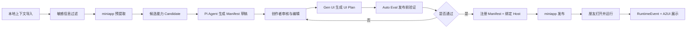

# Agentic Miniapp Builder 需求与架构设计讨论稿

**日期:** 2026-05-28  
**状态:** 讨论稿，未进入实现计划  
**关联文档:** `docs/superpowers/specs/2026-05-28-agentic-app-manifest-a2ui-bridge-spec.zh.md`  
**关联代码承载点:** `apps/share-gateway/src/adapters/provider.ts`、`apps/share-gateway/src/adapters/providerRegistry.ts`、`apps/share-gateway/src/adapters/types.ts`、`apps/share-web-react/src/App.ts`

---

## 1. 背景

当前大流程可以理解为：

1. 用户本地上下文一键导入。
2. 敏感信息过滤。
3. miniapp 预提取。
4. 进入红框能力：把预提取结果变成一个“有不错交互的 Agent”。
5. miniapp 发布。
6. 平台处理。

红框内实际包含三件事：

- **Pi Agent:** 把预提取出的重复工作流、证据、风险、用户目标整理成可运行的 agent 契约。
- **Gen UI:** 根据 agent 的交互模式生成或选择合适的交互组件。
- **Auto Eval:** 在发布前验证这个 agent 是否真的可用、是否越界、是否能稳定产出结果。

这里最关键的判断是：红框不应该做成一个黑盒“大模型生成器”。它应该产出一个可校验、可运行、可回放、可发布的结构化交接物。现有底层 spec 已经把这个交接物收敛为 `AgenticAppManifest`，本设计稿在此基础上补齐需求、流程、架构分层和待讨论问题。

---

## 2. 设计目标

### 2.1 产品目标

把一个人的历史上下文或工作流沉淀成可分享、可运行、带交互 UI 的 miniapp agent。

这个 agent 需要满足：

- 朋友或消费者打开后能快速理解它能做什么。
- 运行前能补齐必要上下文，而不是直接丢给一个空聊天框。
- 执行时遵守创作者定义的边界。
- 涉及敏感、写操作、高风险行为时能触发确认或审批。
- 发布前经过自动验证，不把半成品推到分发层。

### 2.2 工程目标

- **阶段产物清楚。** Raw Input 进入系统后先标准化为 `RawInputPackage`；Candidate Extraction 产出 `ExtractionResult`；Manifest Drafting 产出 `AgenticAppManifestDraft`；Gen UI 产出 `GeneratedUiPlan`；Auto Eval 产出 `EvaluationReport`；Publish 产出 `PublishedMiniAppRecord`。每个阶段都能单独保存、复跑、对比。
- **生成侧、运行侧、UI 侧用 manifest 解耦。** `AgenticAppManifest` 是 miniapp 的权威契约，不能让运行 adapter、React 组件或 eval 逻辑各自理解一套隐式 prompt。
- **分析 harness 可替换。** MVP 默认用云端 Agent 做 Candidate Extraction，但 harness 必须消费同一份 `RawInputPackage` 并输出同一份 `ExtractionResult`，未来才能替换成本地用户自己的 Agent 能力。
- **运行接入复用现有 provider contract。** miniapp 运行时不新增一套执行协议，而是通过一个 `ManifestAgentAdapter` 包住现有 `ProviderAdapter`，再注册进 `ProviderRegistry`。
- **运行事件复用现有事件流。** 任务状态、进度、确认、审批、输出和失败都落到现有 `RuntimeEvent`，再转换成 AG-UI/assistant-ui 可消费的前端事件。
- **UI 生成保持受控。** Gen UI 第一版只生成 `GeneratedUiPlan`，由 React `/v2` 的组件注册表渲染；LLM 不直接生成可上线的任意前端代码。
- **发布前有可执行门禁。** Auto Eval 至少覆盖 schema、candidate 质量、UI plan 可渲染、mock run 可完成、安全边界字段、确认/审批映射；失败项能阻断 publish 或进入 manual review。
- **发布物可追踪。** published miniapp 必须能追溯到 source package、extraction run、candidate、manifest draft、ui plan、eval report、host binding 和发布事件。
- **版本迁移可控。** manifest、UI plan、eval report 都要带版本号；未来字段变化通过 parser/migration 处理，而不是靠调用方兼容零散字段。
- **测试能按层拆开。** Candidate Extraction、Manifest Drafting、Gen UI、Auto Eval、Runtime Adapter、Publish Registry 分别有 contract test；端到端测试只验证主链路，不承担所有细节断言。

---

## 3. 核心决策

### 决策 1: manifest 是唯一权威交接物

红框最终产物不是一段 prompt，也不是一段前端代码，而是 `AgenticAppManifest`。

它至少包含：

- `manifest`: miniapp 身份、版本、状态、创作者信息。
- `agent`: 角色、目标、边界、可用工具。
- `skill_set`: 可复用步骤和停止条件。
- `interaction`: UI profile、starter prompts、required context、review questions。
- `context_contract`: connector、访问级别、隐私规则。
- `llm_boundary`: 允许、禁止、必须确认的行为。
- `runbook`: 执行步骤和 checkpoint。
- `safety`: 风险等级和免责声明。
- `provenance`: 证据来源，但默认不暴露给消费者。

### 决策 2: 一个 ManifestAgentAdapter 包住底层 provider

不要做“一个 miniapp 一个 adapter”。运行侧只需要一个 `ManifestAgentAdapter`：

- manifest 负责策略层。
- Codex/Claude/OpenCode 等 `ProviderAdapter` 负责执行层。
- `ManifestAgentAdapter` 把 manifest 编译成 system policy、上下文补齐策略、风险守卫，再调用底层 provider。

### 决策 3: Gen UI 第一版只生成 UI plan，不生成任意可执行代码

第一版 UI 生成建议走组件注册表：

- manifest 里只放 `interaction.ui_profile.components`。
- React `/v2` 入口读取组件名。
- `componentRegistry` 把组件名映射到受控 React 组件。
- 未知组件降级到通用组件，例如 `intake_form`、`checklist`、`artifact_builder`。

这样能避免 LLM 生成前端代码后直接上线带来的安全和维护问题。

### 决策 4: Auto Eval 是发布门禁

Auto Eval 不只是质量报告，而是 publish gate。

没有通过 eval 的 miniapp：

- 可以保存为 draft。
- 可以返回给创作者修改。
- 不能进入 published/private/public 分发状态。

### 决策 5: 运行位置优先放在创作者 Host

朋友不带模型 key、不拥有创作者上下文。miniapp 运行在创作者绑定的 Host 上，朋友侧只发起任务和补充输入。

这样能复用现有 outbound Host/share-link 模型，也能保持成本、device key、预算、底层 adapter 对朋友隐藏。

---

## 4. 用户与需求

### 4.1 创作者

创作者希望从历史工作流中提取一个可分享的 miniapp。

关键需求：

- 能看到系统提取出的 agent 名称、目标、适用场景。
- 能修改 agent 边界、确认问题、所需上下文。
- 能看到风险等级和为什么这么判断。
- 能预览朋友打开后的交互界面。
- 能看到自动验证结果，再决定是否发布。

### 4.2 消费者或朋友

消费者希望打开 miniapp 后能完成一个明确任务，而不是研究 agent 怎么用。

关键需求：

- 入口能说明这个 miniapp 能解决什么问题。
- 开始时只问必要问题。
- 运行中能看见进度、需要确认的动作、最终产物。
- 不应该看到创作者的原始上下文、成本、token、device key、内部证据。

### 4.3 平台或运行系统

平台需要保证发布物可控、可运行、可追责。

关键需求：

- manifest 可校验、可版本化。
- 每个 published miniapp 能绑定 owner、host、baseAdapter。
- 运行事件走统一 `RuntimeEvent`。
- 高风险行为能走现有确认和审批链路。
- eval 结果可持久化，发布决策可审计。

---

## 5. 功能需求

### 5.1 Candidate Import

输入来自 miniapp 预提取阶段，至少需要包含：

- 候选工作流名称。
- 重复发生的任务描述。
- 目标用户。
- 稳定输入。
- 期望输出。
- 风险等级初判。
- 证据引用。
- 推荐形态，例如 agentic app、skill set、automation、extend existing、skip。

这层只接收“预提取候选”，不直接读用户原始完整上下文。

### 5.2 Pi Agent Manifest Authoring

Pi Agent 的职责是把候选能力整理成 manifest 草稿。

它应该输出：

- agent role 和 goal。
- 明确的 boundaries。
- skill set steps。
- stopping condition。
- required context。
- starter prompts。
- review questions。
- connector access。
- llm boundary。
- runbook checkpoints。
- eval cases 初稿。

它不应该：

- 私自扩大 connector 权限。
- 把证据原文暴露给消费者。
- 直接把创作者原始对话拼进运行 prompt。
- 直接决定 published 状态。

### 5.3 Human Review

创作者发布前必须能 review 这些字段：

- 名称和描述。
- agent 能做什么、不能做什么。
- 需要朋友提供哪些上下文。
- 是否需要连接器或文件。
- 哪些动作需要朋友确认。
- 哪些动作需要创作者审批。
- 免责声明。
- 预览 UI。
- 自动验证结果。

第一版可以只做表单式 review，后续再做更高级的 diff/editor。

### 5.4 Gen UI

Gen UI 输入 manifest 的 `interaction.ui_profile`，输出 `GeneratedUiPlan`。

第一版建议支持这些组件：

- `intake_form`: 收集 required context。
- `checklist`: 展示步骤、准备项或确认项。
- `artifact_builder`: 展示最终产物结构。
- `diagnostic_matrix`: 多维诊断。
- `scorecard`: 评分和建议。
- `evidence_board`: 展示非敏感证据摘要。

未知组件降级策略：

1. 如果有 `required_context`，使用 `intake_form`。
2. 如果有 `runbook.steps`，使用 `checklist`。
3. 默认使用 `artifact_builder`。

### 5.5 Runtime Registration

通过校验的 manifest 进入 registry：

- `mini_app_id -> manifest`
- `mini_app_id -> ownerId`
- `mini_app_id -> hostId`
- `mini_app_id -> baseAdapter preference`
- `mini_app_id -> publish status`

运行时注册到 `ProviderRegistry`：

```ts
providerRegistry.register({
  id: manifest.manifest.mini_app_id,
  factory: () => new ManifestAgentAdapter(manifest, baseAdapter),
});
```

### 5.6 Runtime Guard

manifest 字段和运行时事件的映射：

| manifest 字段 | 运行时行为 |
|---|---|
| `llm_boundary.requires_confirmation_before` | 触发 `task.needs_user_confirm` |
| `safety.risk_level = high` | 高风险动作升级为 `task.needs_owner_approval` |
| `context_contract.connectors[].access = write` | 写操作前强制朋友确认 |
| `context_contract.connectors[].access = presence_only` | 只确认是否具备，不把原文进 prompt |
| `llm_boundary.disallowed` | 注入 policy，并在事件流里拦截越界输出 |
| `safety.disclaimer` | 首屏或首条 assistant 消息展示 |

### 5.7 Auto Eval

Auto Eval 至少包含：

- manifest schema/version 校验。
- required context 覆盖检查。
- UI 组件解析检查。
- mock run 测试。
- prompt injection 基线测试。
- disallowed 行为测试。
- confirmation/approval 触发测试。
- artifact 输出检查。
- 隐私泄露检查。

每次 eval 产出 `EvaluationReport`，包括：

- `status`: passed、failed、warning。
- `scores`: 可用性、交互完整性、安全、稳定性。
- `failures`: 失败项和复现输入。
- `warnings`: 可发布但建议修改的问题。
- `publishGate`: allow、block、manual_review。

---

## 6. 端到端流程



### 6.1 Draft 阶段

1. 预提取阶段产生 candidate。
2. Pi Agent 生成 manifest 草稿。
3. 系统运行 `parseManifest()`，缺字段或未知版本直接失败。
4. 草稿保存为 draft。

### 6.2 Review 阶段

1. 创作者检查 agent metadata。
2. 创作者检查边界和权限。
3. 创作者检查 UI preview。
4. 创作者可以修改 manifest 中的人类可编辑字段。

### 6.3 Eval 阶段

1. 使用 deterministic mock adapter 跑基础任务。
2. 使用风险样例验证 confirmation/approval。
3. 使用 UI render smoke 验证 `/v2` 能渲染组件。
4. 使用 privacy scan 验证不会暴露原始证据、token、device key、预算。
5. 生成 `EvaluationReport`。

### 6.4 Publish 阶段

1. eval 通过。
2. 绑定 owner host。
3. 选择或推断 baseAdapter。
4. 写入 manifest registry。
5. 注册 provider entry。
6. 生成 miniapp share/public/private 入口。

### 6.5 Run 阶段

1. 朋友打开 miniapp。
2. React `/v2` 页面加载 manifest interaction。
3. A2UI 组件收集 required context。
4. task 进入 `ManifestAgentAdapter`。
5. adapter 编译 manifest policy，并调用底层 provider。
6. RuntimeEvent 转成 AG-UI 事件。
7. UI 展示进度、确认、审批、输出。

---

## 7. 架构分层

### 7.1 Orchestration 层

职责：

- 串起 candidate -> manifest -> review -> UI plan -> eval -> publish。
- 管理状态机。
- 决定什么时候允许进入下一阶段。

建议状态：

- `candidate_created`
- `manifest_drafted`
- `needs_creator_review`
- `ui_planned`
- `eval_running`
- `eval_failed`
- `eval_passed`
- `published_private`
- `published`
- `revoked`

### 7.2 Contract 层

职责：

- 定义 `AgenticAppManifest`。
- 提供 `parseManifest()`。
- 处理 `manifestVersion`。
- 输出结构化错误。

失败策略：

- 未知版本直接拒绝。
- 缺失安全字段直接拒绝。
- 缺失 UI 组件可以降级，但要产生 warning。
- 缺失 provenance 可以保存 draft，但不能 publish。

### 7.3 Pi Agent 层

职责：

- 从 candidate 生成 manifest 草稿。
- 生成 eval cases 初稿。
- 生成 review questions。
- 提供 confidence 和 risk rationale。

边界：

- 不直接发布。
- 不直接写 registry。
- 不直接调用真实 provider。
- 不绕过 human review。

### 7.4 Gen UI 层

职责：

- 从 `interaction.ui_profile` 解析 UI intent。
- 选择组件。
- 生成布局 plan。
- 为未知组件降级。

第一版输出：

```ts
type GeneratedUiPlan = {
  miniAppId: string;
  profileType: string;
  components: Array<{
    name: string;
    source: "manifest" | "fallback";
    reason: string;
  }>;
  layout: "thread_with_side_panel" | "intake_then_thread" | "artifact_workspace";
  warnings: string[];
};
```

### 7.5 Runtime Adapter 层

职责：

- 实现 `ManifestAgentAdapter implements ProviderAdapter`。
- 透传 detect/start/stop 到 baseAdapter。
- submitTask 前编译 manifest policy。
- streamEvents 时增加安全守卫。

关键原则：

- provider contract 不变。
- 底层 adapter 不知道 manifest 细节。
- manifest 策略只在 wrapper 层生效。

### 7.6 Policy/Safety 层

职责：

- 判断操作是否需要确认。
- 判断是否需要 owner approval。
- 防止 disallowed 行为流出。
- 防止敏感 provenance 泄露。
- 对 presence-only connector 做最小披露。

这里应该尽量复用现有 `highRiskActions` 和 RuntimeEvent 类型，而不是另建一套审批模型。

### 7.7 Registry/Persistence 层

职责：

- 存 manifest。
- 存 host binding。
- 存 publish status。
- 存 eval report。
- 存 audit log。

建议持久化对象：

- `miniAppManifestRecords`
- `miniAppHostBindings`
- `miniAppEvaluationReports`
- `miniAppPublishEvents`

第一版可以复用当前 JSONL/snapshot 风格，后续规模上来再迁移到数据库。

### 7.8 A2UI/Frontend 层

职责：

- 渲染 React `/v2` 体验。
- 读取 `__RALPHLOOP_STATE__` 或等价 initial state。
- 根据 manifest interaction 渲染组件。
- 展示 RuntimeEvent 转换后的 AG-UI 事件。
- 展示 confirmation/approval 卡片。

组件注册表示例：

```ts
const A2UI_COMPONENTS = {
  intake_form: IntakeForm,
  checklist: Checklist,
  artifact_builder: ArtifactBuilder,
  diagnostic_matrix: DiagnosticMatrix,
  scorecard: Scorecard,
};
```

---

## 8. 核心模块建议

### 8.1 share-gateway

新增：

- `apps/share-gateway/src/miniapp/manifest.ts`
- `apps/share-gateway/src/miniapp/manifestRegistry.ts`
- `apps/share-gateway/src/miniapp/manifestAgentAdapter.ts`
- `apps/share-gateway/src/miniapp/evaluation.ts`
- `apps/share-gateway/src/miniapp/uiPlan.ts`

改动：

- `httpServer.ts`: 增加 `POST /v1/miniapps/import`。
- `httpServer.ts`: `/app/share/:token/v2` 注入 miniapp interaction state。
- `relayStore.ts` 或等价 store: 增加 manifest/eval/publish 记录。

### 8.2 share-web-react

新增：

- `apps/share-web-react/src/a2ui/componentRegistry.ts`
- `apps/share-web-react/src/a2ui/components/IntakeForm.ts`
- `apps/share-web-react/src/a2ui/components/Checklist.ts`
- `apps/share-web-react/src/a2ui/components/ArtifactBuilder.ts`
- `apps/share-web-react/src/a2ui/generatedUiPlan.ts`

改动：

- `apps/share-web-react/src/App.ts`: 在 thread shell 外侧或上方挂载 A2UI 区域。

---

## 9. 接口草案

### 9.1 Import Manifest

```http
POST /v1/miniapps/import
Content-Type: application/json
```

请求：

```json
{
  "ownerId": "owner_123",
  "hostId": "host_123",
  "baseAdapterId": "codex",
  "manifest": {}
}
```

响应：

```json
{
  "miniAppId": "miniapp_123",
  "status": "draft",
  "manifestVersion": "0.1",
  "warnings": []
}
```

### 9.2 Run Eval

```http
POST /v1/miniapps/:miniAppId/evaluations
```

响应：

```json
{
  "evaluationId": "eval_123",
  "status": "passed",
  "publishGate": "allow",
  "failures": [],
  "warnings": []
}
```

### 9.3 Publish

```http
POST /v1/miniapps/:miniAppId/publish
```

请求：

```json
{
  "visibility": "published_private"
}
```

响应：

```json
{
  "miniAppId": "miniapp_123",
  "status": "published_private",
  "shareUrl": "/app/share/local-friend/v2"
}
```

---

## 10. Auto Eval 详细设计

### 10.1 Eval 类型

| Eval | 目的 | 失败是否阻断发布 |
|---|---|---|
| Schema eval | manifest 字段完整、版本正确 | 是 |
| Policy eval | 禁止行为、确认行为、审批行为能映射 | 是 |
| UI eval | 组件能解析并渲染 | 是，除非可降级 |
| Runtime smoke | mock run 能完成一次任务 | 是 |
| Privacy eval | 不泄露原始 evidence/token/device/cost | 是 |
| UX eval | required context 不为空洞，starter prompts 可用 | 可 warning |
| Regression eval | 旧版本 manifest 迁移后仍可运行 | 是 |

### 10.2 Eval 输入来源

- manifest 自带 `starter_prompts`。
- Pi Agent 生成的 eval cases。
- 平台内置风险样例。
- 历史失败样例。

### 10.3 发布规则

建议第一版规则：

- schema/policy/privacy/runtime 任一失败，禁止发布。
- UI eval 失败但可降级，允许进入 manual review。
- UX eval 失败，允许保存 draft，不允许 public publish。
- warnings 超过阈值，进入 manual review。

---

## 11. 隐私与安全边界

### 11.1 默认隐藏

消费者默认不应该看到：

- 创作者原始 session message。
- evidence refs 对应的原文。
- device key。
- token hash。
- budget/cost。
- host 内部 adapter 配置。
- provider API key。

### 11.2 presence-only connector

`presence_only` 的意思是：

- 可以告诉 agent “用户已连接某类数据源”。
- 不把数据源原文注入 prompt。
- 需要读取具体内容时必须升级为 explicit opt-in 或 confirmation。

### 11.3 写操作

任何写操作至少需要朋友确认。高风险写操作需要创作者审批。

例子：

- 发送邮件。
- 修改文件。
- 发布网页。
- 调用外部 API 产生副作用。
- 删除或覆盖数据。

---

## 12. 推荐里程碑

### M1: Manifest Contract

目标：

- 定义 `AgenticAppManifest`。
- 实现 `parseManifest()`。
- 支持 draft import。
- 加 schema 测试。

验收：

- 合法 manifest 通过。
- 缺安全字段失败。
- 未知版本失败。
- 缺 UI 组件产生 warning。

### M2: ManifestAgentAdapter

目标：

- wrapper adapter 能包住 mock provider。
- policy 编译进入 prompt。
- confirmation/approval 能映射到 RuntimeEvent。

验收：

- provider contract 测试通过。
- disallowed 行为被拦截。
- required confirmation 产生 `task.needs_user_confirm`。

### M3: A2UI Component Registry

目标：

- React `/v2` 能根据 manifest 渲染组件。
- 支持 intake/checklist/artifact 三件套。
- 未知组件可降级。

验收：

- hydration test 通过。
- UI plan test 通过。
- browser smoke 能看到组件和 agent 输出。

### M4: Auto Eval Gate

目标：

- eval report 可生成。
- publish 前强制检查。
- 失败项可回到 review 阶段。

验收：

- schema/policy/privacy/runtime eval 失败会 block。
- 通过 eval 才能 publish。
- eval report 可查询。

### M5: Creator Review UX

目标：

- 创作者能编辑 manifest 关键字段。
- 能预览 UI。
- 能看到 eval report。

验收：

- 修改后会重新 eval。
- 发布事件有 audit log。

---

## 13. 待讨论问题

1. **baseAdapter 绑定时机:** publish 时锁定一个，还是 run 时按 Host 当前可用动态选择？
2. **UI schema 深度:** 第一版只用组件名是否足够？什么时候需要 props schema？
3. **Human review 强度:** 所有 miniapp 都必须人工 review，还是低风险可以 auto approve？
4. **Eval 的模型依赖:** Auto Eval 用 mock adapter、真实 adapter，还是两者都用？
5. **证据可见性:** 消费者是否能看到压缩后的 evidence summary？默认建议只看 `capability_basis.why`。
6. **失败回路:** Eval 失败后是让 Pi Agent 自动修 manifest，还是只提示创作者手动改？
7. **发布等级:** 是否区分 draft、published_private、published、marketplace_ready？
8. **组件扩展机制:** 第三方组件是否允许？如果允许，审核和沙箱怎么做？

---

## 14. 推荐结论

第一版应该采用：

- `AgenticAppManifest` 作为唯一契约。
- `ManifestAgentAdapter` 包装现有 provider。
- React `/v2` + A2UI component registry 承载交互 UI。
- Auto Eval 作为 publish gate。
- miniapp 运行在创作者 Host。
- provenance 默认对消费者隐藏。

这条路线的优点是：

- 能直接复用现有 share-gateway/share-web-react 架构。
- 风险边界清楚。
- 第一个版本可以小步落地。
- 后续可以逐步增强 Gen UI 和 Auto Eval，而不用推翻运行层。

---

## 15. 本文档的完成标准

这份讨论稿完成后，下一步应该能围绕以下问题开会或继续细化：

- manifest 字段是否足以表达红框 agent？
- Pi Agent、Gen UI、Auto Eval 的边界是否清楚？
- 运行位置和安全边界是否符合产品预期？
- 第一版是否接受“组件注册表优先，不生成任意前端代码”？
- Auto Eval 哪些检查必须阻断发布？

如果这些问题达成一致，再进入实现计划，而不是现在直接写代码。
