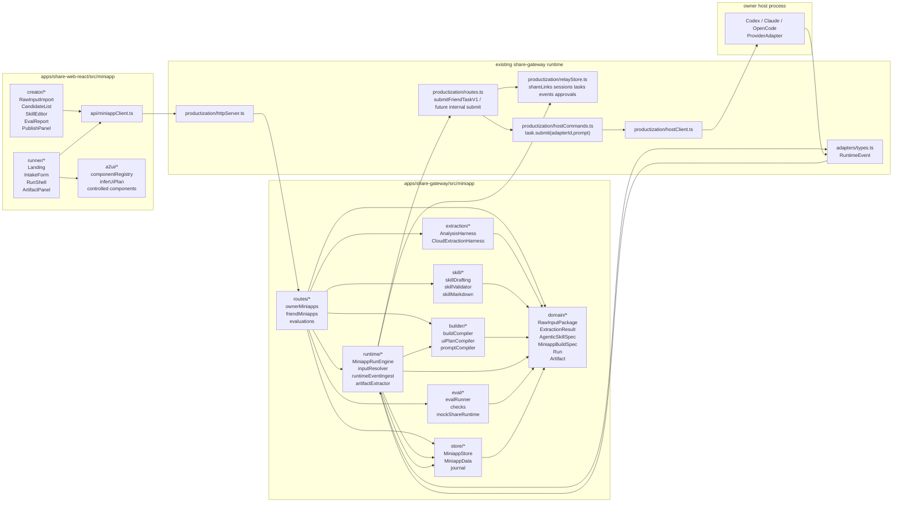
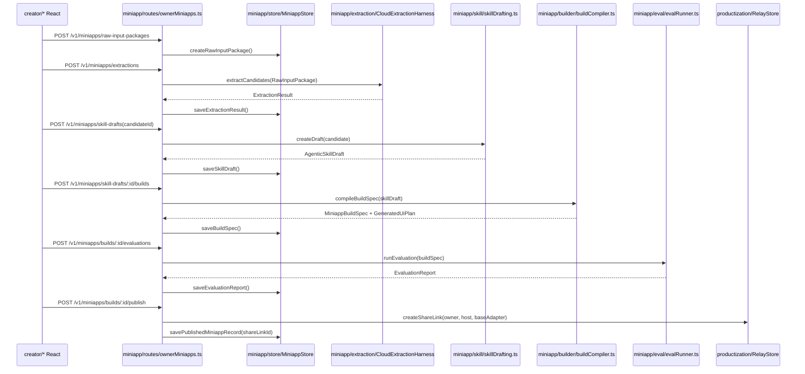
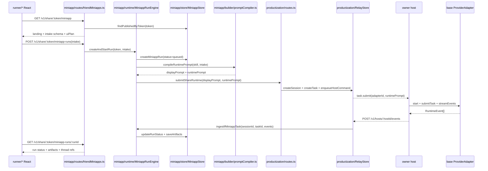

# Agentic Miniapp 代码/项目结构设计稿

**日期:** 2026-05-28  
**状态:** 讨论稿，未进入实现计划  
**目标:** 重新设计一个能真正实现 miniapp 创建、发布、运行、artifact 展示和 eval 的代码结构。  
**关联现状:**
- 后端运行在 `apps/share-gateway/`，Node.js + TypeScript stripped runtime。
- 状态层已有 `RelayStore` + JSONL journal。
- 运行层已有 `ProviderAdapter`、`ProviderRegistry`、`RuntimeEvent`。
- 消费者前端已有 `apps/share-web-react/` 的 React `/v2` shell。
- 当前 host command 只支持 `adapterId + prompt`，执行发生在 owner host。

---

## 1. 重新定性

上一版“miniapp 产物目录”不足以实现功能，因为它只描述了 skill/build spec 文件，没有描述平台如何：

- 从 Raw Input 创建候选能力。
- 让创作者审核和发布。
- 让消费者打开并提交 intake。
- 把 miniapp 转成可执行 runtime prompt。
- 调用现有 host/base adapter。
- 把事件、artifact、确认/审批回写到页面。
- 跑 Auto Eval 并阻断发布。

本版设计的核心判断：

> miniapp 不是一个独立代码工程，而是 share-gateway/share-web-react 平台里的一个可运行对象。它的“代码”主要是平台 runtime、store、routes 和 React views；miniapp 自身是数据化的 `AgenticSkillSpec + MiniappBuildSpec + GeneratedUiPlan`。

---

## 2. MVP 运行策略

### 2.1 不新增 host 协议

MVP 不新增 `HostCommand` 类型，也不要求 owner host 理解 miniapp package。

原因：

- 当前 host command 已稳定支持 `task.submit(adapterId, prompt)`。
- owner host 只知道 Codex/Claude/OpenCode 等 base adapter。
- 如果立刻要求 host 支持 `miniapp:<id>` adapter，需要同步改 host command、host client、provider registry、adapter install/discovery，范围过大。

### 2.2 Gateway 编译 runtime prompt

MVP 路线：

1. Gateway 保存 miniapp skill/build spec。
2. 消费者提交 intake。
3. Gateway 用 `promptCompiler` 把 skill + intake + run context 编译成 `runtimePrompt`。
4. Gateway 把 `runtimePrompt` 交给现有 share task 链路。
5. owner host 用 base adapter 执行，不知道 miniapp 细节。
6. Gateway 在事件回传后提取 artifact、更新 miniapp run。

这条路线让 miniapp 先跑起来，同时保留未来升级点：如果以后 owner host 能直接安装 miniapp harness，再引入 `MiniappProviderAdapter`。

---

## 3. 总体模块图

### 3.1 代码模块依赖图



### 3.2 创建与发布调用路径



### 3.3 消费者运行调用路径



---

## 4. 后端项目结构

新增一个独立模块根：

```text
apps/share-gateway/src/miniapp/
  domain/
    ids.ts
    rawInput.ts
    candidate.ts
    skill.ts
    buildSpec.ts
    uiPlan.ts
    evaluation.ts
    publish.ts
    run.ts
    artifact.ts
    errors.ts

  store/
    miniappData.ts
    miniappStore.ts
    miniappStoreJournal.ts

  extraction/
    analysisHarness.ts
    cloudExtractionHarness.ts
    extractionPrompts.ts
    evidenceMapper.ts

  skill/
    skillDrafting.ts
    skillValidator.ts
    skillMarkdown.ts

  builder/
    buildCompiler.ts
    runtimePolicyCompiler.ts
    uiPlanCompiler.ts
    promptCompiler.ts

  runtime/
    miniappRunEngine.ts
    inputResolver.ts
    runtimePrompt.ts
    runtimeEventIngest.ts
    artifactExtractor.ts
    policyGuard.ts
    runEventMapper.ts

  eval/
    evalRunner.ts
    evalCaseGenerator.ts
    mockShareRuntime.ts
    checks.ts

  routes/
    ownerMiniapps.ts
    friendMiniapps.ts
    miniappEvaluations.ts

  index.ts
```

### 4.1 依赖方向

依赖必须单向：

```text
domain <- store
domain <- extraction
domain <- skill
domain <- builder
domain <- runtime
domain <- eval
store  <- routes
builder <- runtime
runtime <- routes
eval <- routes
```

禁止：

- `domain/` 依赖 routes/store/React。
- `extraction/` 直接写 publish record。
- `builder/` 直接调用 host runtime。
- `runtime/` 直接生成 skill draft。
- `React` 直接理解 extraction prompt。

---

## 5. 核心领域对象

### 5.1 RawInputPackage

位置：`miniapp/domain/rawInput.ts`

用途：标准化用户导入的真实上下文，给 extraction harness 使用。

```ts
export type RawInputPackage = {
  id: string;
  ownerId: string;
  createdAt: string;
  purpose: "miniapp_candidate_extraction";
  sources: RawInputSource[];
  chunks: RawInputChunk[];
  sourceMap: RawInputSourceMapEntry[];
  warnings: RawInputWarning[];
};
```

### 5.2 ExtractionResult

位置：`miniapp/domain/candidate.ts`

用途：保存 Candidate Extraction 的结果，不直接等于 miniapp。

```ts
export type ExtractionResult = {
  id: string;
  ownerId: string;
  packageId: string;
  createdAt: string;
  harness: AnalysisHarnessDescriptor;
  candidates: CapabilityCandidate[];
  rejectedIdeas: RejectedCapabilityIdea[];
  warnings: ExtractionWarning[];
};
```

### 5.3 AgenticSkillSpec

位置：`miniapp/domain/skill.ts`

用途：miniapp 的核心通用能力定义。它替代“权威 Manifest”的角色。

```ts
export type AgenticSkillSpec = {
  version: "0.1";
  name: string;
  description: string;
  whenToUse: string;
  targetUser: string;
  jobToBeDone: string;
  inputsNeeded: SkillInputField[];
  workflowSteps: string[];
  constraints: string[];
  expectedOutput: SkillOutputContract;
  examples: SkillExample[];
  failureModes: string[];
  evalCases: SkillEvalCase[];
  tags: string[];
};
```

### 5.4 MiniappBuildSpec

位置：`miniapp/domain/buildSpec.ts`

用途：平台内部编译产物，用来运行、渲染、eval、发布。

```ts
export type MiniappBuildSpec = {
  id: string;
  ownerId: string;
  skillDraftId: string;
  skill: AgenticSkillSpec;
  runtimePolicy: RuntimePolicy;
  uiPlan: GeneratedUiPlan;
  evalPlan: EvalPlan;
  createdAt: string;
};
```

### 5.5 PublishedMiniappRecord

位置：`miniapp/domain/publish.ts`

用途：发布记录，连接 miniapp 与现有 share link/host/base adapter。

```ts
export type PublishedMiniappRecord = {
  id: string;
  ownerId: string;
  buildSpecId: string;
  shareLinkId: string;
  tokenHash: string;
  hostId: string;
  baseAdapterId: string;
  status: "published_private" | "published" | "revoked";
  latestEvaluationId: string;
  createdAt: string;
  updatedAt: string;
};
```

### 5.6 MiniappRunRecord

位置：`miniapp/domain/run.ts`

用途：消费者的一次 miniapp 运行。它桥接 miniapp 世界和现有 session/task 世界。

```ts
export type MiniappRunRecord = {
  id: string;
  miniappId: string;
  shareLinkId: string;
  sessionId?: string;
  taskId?: string;
  friendActorId: string;
  status:
    | "intake_required"
    | "queued"
    | "running"
    | "needs_user_confirm"
    | "needs_owner_approval"
    | "completed"
    | "failed"
    | "cancelled";
  intake: Record<string, unknown>;
  displayPrompt: string;
  runtimePromptRef?: string;
  artifactIds: string[];
  createdAt: string;
  updatedAt: string;
};
```

### 5.7 ArtifactRecord

位置：`miniapp/domain/artifact.ts`

用途：miniapp 的最终用户价值，不要只依赖聊天文本。

```ts
export type ArtifactRecord = {
  id: string;
  miniappRunId: string;
  taskId?: string;
  type: "markdown_report" | "checklist" | "scorecard" | "diagnostic_matrix" | "json";
  title: string;
  content: unknown;
  contentType: "text/markdown" | "application/json";
  createdAt: string;
};
```

---

## 6. Store 设计

### 6.1 不直接塞进 RelayStore 的理由

`RelayStore` 现在负责 share link、host、session、task、runtime events、approval、preview frame。miniapp 会新增 raw input、extraction、skill draft、build、eval、artifact、publish record。如果全部塞进 `RelayData`，会让一个文件承担太多领域职责。

MVP 建议新增 `MiniappStore`，但实现风格复用 `RelayStore`：

- JSON snapshot。
- JSONL journal。
- `snapshot()`。
- append-only mutation。
- 测试用内存 store。

### 6.2 MiniappData

位置：`miniapp/store/miniappData.ts`

```ts
export type MiniappData = {
  rawInputPackages: RawInputPackage[];
  extractionResults: ExtractionResult[];
  skillDrafts: AgenticSkillDraftRecord[];
  buildSpecs: MiniappBuildSpec[];
  evaluations: EvaluationReport[];
  publishedMiniapps: PublishedMiniappRecord[];
  runs: MiniappRunRecord[];
  artifacts: ArtifactRecord[];
};
```

### 6.3 与 RelayStore 的关系

`MiniappStore` 保存 miniapp 领域数据。`RelayStore` 继续保存运行共享链路数据。

引用关系只用 ID：

- `PublishedMiniappRecord.shareLinkId -> RelayStore.ShareLinkRecord.id`
- `PublishedMiniappRecord.hostId -> RelayStore.HostRecord.id`
- `MiniappRunRecord.sessionId -> RelayStore.SessionRecord.id`
- `MiniappRunRecord.taskId -> RelayStore.TaskRecord.id`
- `ArtifactRecord.taskId -> RelayStore.TaskRecord.id`

这样 miniapp 模块可以演进，不破坏现有 share runtime。

---

## 7. Creator Flow 后端

### 7.1 Routes

位置：`miniapp/routes/ownerMiniapps.ts`

建议 API：

```text
POST   /v1/miniapps/raw-input-packages
POST   /v1/miniapps/extractions
GET    /v1/miniapps/extractions/:extractionId
POST   /v1/miniapps/skill-drafts
GET    /v1/miniapps/skill-drafts/:draftId
PATCH  /v1/miniapps/skill-drafts/:draftId
POST   /v1/miniapps/skill-drafts/:draftId/builds
POST   /v1/miniapps/builds/:buildId/evaluations
POST   /v1/miniapps/builds/:buildId/publish
GET    /v1/miniapps/:miniappId
```

### 7.2 流程

```text
createRawInputPackage
  -> runExtraction
  -> createSkillDraftFromCandidate
  -> patchSkillDraft
  -> compileBuildSpec
  -> runEvaluation
  -> publishMiniapp
```

### 7.3 发布时做什么

`publishMiniapp` 必须：

1. 检查 build spec 存在。
2. 检查 latest evaluation 允许发布。
3. 检查 host 在线或至少存在。
4. 检查 base adapter 在 share policy 中允许。
5. 创建或复用 `ShareLinkRecord`。
6. 写入 `PublishedMiniappRecord`。
7. 记录 audit log。

---

## 8. Consumer Run 后端

### 8.1 Routes

位置：`miniapp/routes/friendMiniapps.ts`

建议 API：

```text
GET  /v1/share/:token/miniapp
POST /v1/share/:token/miniapp-runs
GET  /v1/share/:token/miniapp-runs/:runId
GET  /v1/share/:token/miniapp-runs/:runId/artifacts
POST /v1/share/:token/miniapp-runs/:runId/messages
```

其中：

- `/miniapp` 返回 landing/intake/UI plan 初始状态。
- `/miniapp-runs` 创建一次运行。
- `/messages` 是 follow-up，后续可以复用同一个 session。

### 8.2 MiniappRunEngine

位置：`miniapp/runtime/miniappRunEngine.ts`

职责：

1. 根据 token 找到 `PublishedMiniappRecord`。
2. 读取 build spec。
3. 用 `inputResolver` 校验 intake 是否齐全。
4. 生成 `displayPrompt` 和 `runtimePrompt`。
5. 创建 `MiniappRunRecord`。
6. 调用现有 share task 提交流程。
7. 建立 `miniappRunId -> sessionId/taskId` 映射。
8. 接收 runtime events 后更新 run status。
9. 用 `artifactExtractor` 从输出里提取 artifact。

### 8.3 关键集成点

现有 `submitFriendTaskV1` 只接收一个 `prompt`。miniapp 需要区分：

- `displayPrompt`: 给 UI/audit 看的用户输入摘要。
- `runtimePrompt`: 给 base adapter 的完整编译 prompt。

建议抽一个内部函数：

```ts
type SubmitShareRuntimeInput = {
  store: RelayStore;
  runtimes: HostRuntimeRegistry;
  token: string;
  sessionId?: string;
  displayPrompt: string;
  runtimePrompt: string;
  estimatedTaskBudget?: number;
  metadata?: Record<string, unknown>;
};
```

然后：

- 普通聊天调用时 `displayPrompt === runtimePrompt`。
- miniapp 调用时 `displayPrompt` 是 intake 摘要，`runtimePrompt` 是 skill 编译结果。

这样不需要改 host command 结构，host 仍然只收到 `prompt`。

---

## 9. Runtime Prompt 编译

位置：`miniapp/builder/promptCompiler.ts` 或 `miniapp/runtime/runtimePrompt.ts`

输入：

```ts
type CompileRuntimePromptInput = {
  skill: AgenticSkillSpec;
  runtimePolicy: RuntimePolicy;
  intake: Record<string, unknown>;
  conversation?: MiniappRunMessage[];
};
```

输出：

```ts
type CompiledRuntimePrompt = {
  displayPrompt: string;
  runtimePrompt: string;
  expectedArtifact: SkillOutputContract;
};
```

Prompt 结构建议：

```text
You are running a published miniapp skill.

Skill:
<name, description, when_to_use, target_user, job_to_be_done>

Inputs from user:
<intake>

Workflow:
<workflow_steps>

Constraints:
<constraints>

Expected output:
<output contract>

Return format:
<artifact extraction markers or JSON schema>
```

MVP 里 artifact 提取可以先要求模型输出 fenced JSON 或 markdown markers；后续再做更强 structured output。

---

## 10. Artifact 提取

位置：`miniapp/runtime/artifactExtractor.ts`

MVP 必须有 artifact，否则 miniapp 只是“包装聊天”。

提取策略：

1. 优先解析模型输出里的 fenced JSON。
2. 解析失败时，把最终 `task.output` 合并为 `markdown_report`。
3. 根据 skill 的 `expectedOutput.type` 选择 artifact 类型。
4. 保存到 `MiniappStore.artifacts`。
5. React 页面从 artifacts endpoint 读取展示。

示例：

```ts
extractArtifacts({
  run,
  taskId,
  skill,
  runtimeEvents,
}): ArtifactRecord[]
```

---

## 11. Event Ingest 与状态同步

位置：`miniapp/runtime/runtimeEventIngest.ts`

现有 RuntimeEvent 仍然是权威运行事件。

miniapp ingest 层负责：

- `task.accepted` -> run queued/running。
- `task.progress` -> run running。
- `task.needs_user_confirm` -> run needs_user_confirm。
- `task.needs_owner_approval` -> run needs_owner_approval。
- `task.output` -> 追加 output buffer。
- `task.completed` -> artifact extraction + run completed。
- `task.failed` -> run failed。
- `task.cancelled` -> run cancelled。

对于 outbound host，事件是 host 完成后 POST 回 gateway。需要在 host events 接收处调用 miniapp ingest：

```text
/v1/hosts/:hostId/events
  -> RelayStore appendRuntimeEvent
  -> miniappRuntimeEventIngest.ingestIfMiniappTask(sessionId, taskId, events)
```

---

## 12. Auto Eval 结构

位置：`miniapp/eval/`

MVP eval 不应该直接打真实 host。先用 mock share runtime 验证编译和 artifact。

```text
evalRunner.ts
  -> validateSkillSpec
  -> validateBuildSpec
  -> renderUiPlanSmoke
  -> compileRuntimePromptSmoke
  -> runMockProvider
  -> extractArtifact
  -> policyChecks
```

Eval 输出 `EvaluationReport`：

```ts
type EvaluationReport = {
  id: string;
  buildSpecId: string;
  status: "passed" | "failed" | "warning";
  publishGate: "allow" | "block" | "manual_review";
  checks: EvaluationCheckResult[];
  createdAt: string;
};
```

发布门禁只看 `publishGate`，不要让 publish route 重新猜测质量。

---

## 13. 前端项目结构

新增：

```text
apps/share-web-react/src/miniapp/
  api/
    miniappClient.ts

  creator/
    RawInputImport.ts
    ExtractionCandidateList.ts
    SkillDraftEditor.ts
    BuildPreview.ts
    EvalReportPanel.ts
    PublishPanel.ts

  runner/
    MiniappLanding.ts
    IntakeFormRenderer.ts
    MiniappRunShell.ts
    MiniappThread.ts
    ArtifactPanel.ts
    ConfirmationCard.ts
    RunStatusBar.ts

  a2ui/
    componentRegistry.ts
    inferUiPlan.ts
    components/
      IntakeForm.ts
      Checklist.ts
      ArtifactWorkspace.ts
      Scorecard.ts
      DiagnosticMatrix.ts

  state/
    miniappRunStore.ts
```

### 13.1 MVP 前端优先级

第一阶段不一定要完整 creator UI。可以先有：

1. 后端 API + 测试创建 miniapp。
2. `/app/share/:token/v2` 能识别 miniapp state。
3. 消费者 runner UI 能 intake、run、artifact。

Creator UI 可以第二阶段补，但接口和 store 要先按 creator flow 设计好。

### 13.2 React App 接入

当前 `App.ts` 只知道 chat threads。需要扩展 initial state：

```ts
type RalphloopReactInitialState = {
  token: string;
  currentThreadId: string;
  threads: RalphloopReactInitialThread[];
  miniapp?: MiniappInitialState;
};
```

如果 `miniapp` 存在：

- 渲染 `MiniappRunShell`。
- shell 内部继续复用现有 thread/runtime store。
- 右侧或下方挂 `ArtifactPanel`。

---

## 14. HTTP Server 接入

现有 `productization/httpServer.ts` 已经负责 `/app/share/:token/v2` 和 API dispatch。建议：

- miniapp route handlers 写在 `miniapp/routes/*.ts`。
- `httpServer.ts` 只做 URL match 和调用 handler。
- 不把 miniapp 业务逻辑塞进 `httpServer.ts`。

需要注入的依赖：

```ts
type MiniappRouteDeps = {
  relayStore: RelayStore;
  miniappStore: MiniappStore;
  runtimes: HostRuntimeRegistry;
  now: () => Date;
};
```

---

## 15. 测试结构

新增：

```text
apps/share-gateway/test/miniapp/
  rawInput.test.ts
  extractionHarness.test.ts
  skillDrafting.test.ts
  buildCompiler.test.ts
  promptCompiler.test.ts
  artifactExtractor.test.ts
  miniappRunEngine.test.ts
  evaluation.test.ts
  publish.test.ts
  routes.test.ts

apps/share-web-react/test/miniapp/
  miniapp-run-shell.test.ts
  intake-form-renderer.test.ts
  artifact-panel.test.ts

apps/share-web/e2e/
  miniapp-run-browser.test.ts
```

### 15.1 必须覆盖的 contract

- Raw Input 能标准化。
- ExtractionResult 能保存和回放。
- Candidate 能生成 SkillDraft。
- SkillDraft 能编译 BuildSpec。
- BuildSpec 能编译 runtime prompt。
- MiniappRunEngine 能调用现有 share task flow。
- RuntimeEvent 能更新 MiniappRunRecord。
- `task.completed` 能生成 ArtifactRecord。
- EvaluationReport 能阻断 publish。
- `/app/share/:token/v2` 能渲染 miniapp intake 和 artifact。

---

## 16. 落地顺序

### Phase 1: Domain + Store

目标：

- 建 `miniapp/domain`。
- 建 `MiniappStore`。
- 增加 raw input、extraction、skill draft、build spec、publish、run、artifact 的记录方法。

验收：

- store roundtrip 测试通过。
- journal recovery 测试通过。

### Phase 2: Builder Pipeline

目标：

- mock extraction harness。
- candidate -> skill draft。
- skill draft -> build spec。
- build spec -> runtime prompt。

验收：

- 一份 fixture raw input 能产出 build spec。
- prompt compiler 输出稳定 snapshot。

### Phase 3: Publish + Share Link

目标：

- publish route 创建 share link 和 `PublishedMiniappRecord`。
- `/v1/share/:token/miniapp` 能返回 miniapp landing/intake state。

验收：

- publish gate 根据 EvaluationReport 放行/阻断。
- token 能解析到 miniapp。

### Phase 4: Miniapp Run Engine

目标：

- `POST /v1/share/:token/miniapp-runs` 创建 run。
- 编译 runtime prompt。
- 调用现有 share task flow。
- 记录 session/task 映射。

验收：

- mock runtime 下 run completed。
- RelayStore 有 task/events。
- MiniappStore 有 run/artifact。

### Phase 5: React Runner

目标：

- `/app/share/:token/v2` 显示 miniapp landing。
- 渲染 intake。
- 提交 run。
- 展示 thread + artifact。

验收：

- React unit test。
- browser e2e。

### Phase 6: Real Extraction + Auto Eval

目标：

- 云端 Agent extraction harness。
- eval runner。
- creator API 闭环。

验收：

- raw input -> candidates -> skill -> eval -> publish -> run 全链路可跑。

---

## 17. 关键设计取舍

### 17.1 为什么不做 miniapp adapter

MVP 里不做 `miniapp:<id>` adapter。因为 owner host 当前只处理 base adapter，强行引入 miniapp adapter 会把实现扩散到 host command 和 provider registry。

先编译 prompt，后续再演进：

```text
MVP: Gateway prompt compile -> base adapter
Later: Host installs miniapp harness -> MiniappProviderAdapter
```

### 17.2 为什么要 Artifact

没有 artifact，miniapp 就只是一个预填 prompt 的聊天入口。Artifact 是用户感知到“这是一个 app”的关键。

### 17.3 为什么独立 MiniappStore

因为 miniapp 的生命周期比 share session 更长，数据类型也更多。RelayStore 继续做 runtime relay；MiniappStore 做产品对象。

### 17.4 为什么 UI plan 不是核心协议

核心协议是 `AgenticSkillSpec`。UI plan 是从 skill/input/output 推导出来的渲染计划，属于平台内部可替换实现。

---

## 18. 当前推荐结论

实现上应该按这个顺序理解：

```text
AgenticSkillSpec 定义能力
MiniappBuildSpec 编译能力
MiniappStore 保存产品对象
PublishedMiniappRecord 绑定 share link
MiniappRunEngine 执行一次消费者 run
Existing share task flow 调 owner host/base adapter
RuntimeEventIngest 同步状态
ArtifactExtractor 产出最终价值
React MiniappRunShell 渲染体验
```

这套结构才能实现我们要的功能。单独的 skill 文件、manifest 或 ui plan 都不够。
